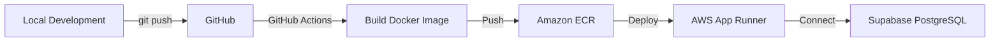

# Finance Tracker API - AWS App Runner Deployment Summary

## ?? What Was Created

### 1. Production Dockerfile
**File**: `apps/api/Dockerfile`

Multi-stage Docker build optimized for AWS App Runner:
- **Build stage**: Uses `mcr.microsoft.com/dotnet/sdk:9.0`
- **Runtime stage**: Uses `mcr.microsoft.com/dotnet/aspnet:9.0` (minimal footprint)
- **Security**: Runs as non-root user
- **Port**: Binds to `8080` (App Runner requirement)
- **Health check**: Built-in for local testing

### 2. Deployment Documentation
**File**: `docs/AWS_APP_RUNNER_DEPLOYMENT.md`

Comprehensive 50-page guide covering:
- Step-by-step deployment instructions
- ECR setup and image management
- App Runner service configuration
- Supabase database integration
- Environment variables reference
- Monitoring and logging with CloudWatch
- Troubleshooting common issues
- CI/CD with GitHub Actions
- Cost estimates and optimization
- Security best practices
- Rollback procedures

### 3. Quick Deploy Guide
**File**: `docs/QUICK_DEPLOY.md`

5-minute quick reference for experienced DevOps engineers:
- Essential commands only
- Configuration reference table
- Troubleshooting shortcuts
- Cost summary

### 4. Deployment Checklist
**File**: `docs/DEPLOYMENT_CHECKLIST.md`

Production-ready checklist covering:
- Pre-deployment setup
- Step-by-step deployment tasks
- Post-deployment verification
- Monitoring setup
- Security configuration
- CI/CD setup
- Ongoing maintenance tasks
- Rollback procedures

### 5. CI/CD Workflow
**File**: `.github/workflows/deploy-apprunner.yml`

Automated deployment pipeline:
- Triggers on push to `main` or manual dispatch
- Builds and pushes Docker image to ECR
- Deploys to App Runner
- Runs health checks
- Provides deployment summary

### 6. Docker Ignore File
**File**: `apps/api/.dockerignore`

Optimizes Docker build context by excluding:
- Build artifacts (`bin/`, `obj/`)
- Test projects
- Documentation
- Development files

### 7. Updated Configuration
**File**: `apps/api/FinanceTracker/appsettings.Production.json`

Added `ConnectionStrings` section for environment variable override support.

### 8. Updated README
**File**: `README.md`

Added AWS App Runner deployment section with:
- Quick deploy instructions
- Cost estimate
- Link to full documentation
- GitHub Actions workflow reference

---

## ?? Key Features

### AWS App Runner Configuration

| Setting | Value | Purpose |
|---------|-------|---------|
| **Port** | 8080 | App Runner requirement |
| **Health Check** | `/health` | Existing endpoint (no code changes needed) |
| **SSL/HTTPS** | Automatic | AWS-managed certificate |
| **Auto-scaling** | 1-3 instances | Based on traffic |
| **CPU** | 1 vCPU | Sufficient for API workload |
| **Memory** | 2 GB | Handles EF Core and connections |

### Environment Variables

```bash
# Required for production
ASPNETCORE_ENVIRONMENT=Production

# Supabase connection string
ConnectionStrings__Default=Host=db.xxxxx.supabase.co;Database=postgres;Username=postgres.xxxxx;Password=xxx;SSL Mode=Require;Trust Server Certificate=true

# CORS for frontend
Cors__AllowedOrigins__0=https://your-frontend.com
```

### Supabase Integration

? **SSL Required**: Connection string includes `SSL Mode=Require`  
? **Direct Connection**: Uses Supabase direct connection (not pooled)  
? **IPv6 Compatible**: App Runner supports IPv6  
? **No VPC**: Supabase is public with authentication  

---

## ?? Deployment Flow



### Manual Deployment (5 minutes)
1. Build Docker image locally
2. Push to Amazon ECR
3. Create App Runner service via Console
4. Apply EF Core migrations
5. Verify endpoints

### Automated Deployment (After setup)
1. Push code to `main` branch
2. GitHub Actions builds and deploys
3. Health checks verify deployment
4. CloudWatch monitors service

---

## ?? Cost Breakdown

**Estimated Monthly Cost**: ~$56-60 USD

| Component | Cost | Calculation |
|-----------|------|-------------|
| Compute (1 vCPU) | ~$46/month | $0.064/vCPU-hour × 24h × 30d |
| Memory (2 GB) | ~$10/month | $0.007/GB-hour × 24h × 30d |
| ECR Storage | <$1/month | Container image storage |
| **Total** | **~$56-60/month** | Always-on, 1 min instance |

**Cost Optimization**:
- Set min instances to 0 for dev/staging
- Use auto-scaling to reduce idle costs
- Clean up old ECR images

---

## ? What You Get

### Infrastructure
- **Auto-scaling**: 1-10 instances based on traffic
- **HTTPS**: AWS-managed certificate (free)
- **Load balancing**: Built-in (no ALB needed)
- **Health checks**: Automatic with `/health` endpoint
- **Zero-downtime**: Deployments are rolling updates

### Monitoring
- **CloudWatch Logs**: Application and request logs
- **CloudWatch Metrics**: Request count, latency, errors
- **Health Status**: Service status dashboard
- **Alarms**: Configurable alerts for errors/downtime

### Security
- **Non-root user**: Container runs as `appuser`
- **SSL/TLS**: Database connections encrypted
- **Image scanning**: ECR scans for vulnerabilities
- **CORS policy**: Restricts frontend origins

### Developer Experience
- **CI/CD Ready**: GitHub Actions workflow included
- **Quick rollback**: Redeploy previous image
- **Easy scaling**: Adjust instance count in console
- **Logs access**: CloudWatch Logs integration

---

## ?? Next Steps

### 1. Deploy to Production
```bash
# Follow the quick deploy guide
cd apps/api
docker build -t finance-tracker-api:latest .
# Push to ECR and create App Runner service
```

### 2. Apply Database Migrations
```bash
cd apps/api/FinanceTracker
export ConnectionStrings__Default="Host=db.xxxxx.supabase.co;..."
dotnet ef database update
```

### 3. Set Up CI/CD
```bash
# Add GitHub Secrets:
# - AWS_ACCESS_KEY_ID
# - AWS_SECRET_ACCESS_KEY
# - APP_RUNNER_SERVICE_ARN

# Push to main branch to trigger deployment
git push origin main
```

### 4. Configure Monitoring
- Set up CloudWatch alarms for 5xx errors
- Create CloudWatch dashboard
- Configure SNS notifications

### 5. Test in Production
```bash
# Get service URL from App Runner console
export API_URL=https://xxxxx.us-east-1.awsapprunner.com

# Test endpoints
curl $API_URL/health
curl $API_URL/categories
```

---

## ?? Documentation Reference

| Document | Purpose | Audience |
|----------|---------|----------|
| `AWS_APP_RUNNER_DEPLOYMENT.md` | Complete deployment guide | DevOps, Cloud Engineers |
| `QUICK_DEPLOY.md` | 5-minute quick reference | Experienced engineers |
| `DEPLOYMENT_CHECKLIST.md` | Pre/post deployment tasks | Project managers, QA |
| `Dockerfile` | Production container config | Docker developers |
| `deploy-apprunner.yml` | CI/CD automation | DevOps, CI/CD engineers |

---

## ?? Support

### Issues During Deployment
1. Check `docs/AWS_APP_RUNNER_DEPLOYMENT.md` ? Troubleshooting section
2. Review CloudWatch logs: `aws logs tail /aws/apprunner/finance-tracker-api/service --follow`
3. Open GitHub issue: https://github.com/zeyadelganainy/finance-tracker-api/issues

### Common Issues
- **Health check failing**: Verify `/health` returns 200 OK
- **Database connection error**: Check Supabase connection string and SSL mode
- **CORS errors**: Add frontend domain to `Cors__AllowedOrigins__0`
- **Service won't start**: Ensure port is set to 8080

---

## ?? Why This Setup?

### AWS App Runner vs. Alternatives

| Feature | App Runner | ECS Fargate | EC2 |
|---------|-----------|-------------|-----|
| **Setup Complexity** | ? Easy | ?? Medium | ??? Hard |
| **Auto-scaling** | ? Built-in | Manual config | Manual config |
| **HTTPS** | ? Automatic | ALB required | Manual setup |
| **Cost** | ~$60/month | ~$40-80/month | ~$30-100/month |
| **Maintenance** | ? Minimal | ?? Medium | ??? High |

**Recommendation**: App Runner is ideal for:
- Small to medium traffic APIs
- Teams without dedicated DevOps
- Fast time-to-market requirements
- Managed infrastructure preference

---

## ? Highlights

### No Code Changes Required
The existing health endpoint (`/health`) is already perfect for App Runner:
```csharp
[HttpGet]
public IActionResult GetHealth()
{
    return Ok(new { status = "ok" });
}
```

### Environment Variable Support
`Program.cs` already reads from configuration:
```csharp
builder.Configuration.GetConnectionString("Default")
```

App Runner sets environment variables like:
```
ConnectionStrings__Default=Host=...
```

### SSL/TLS for Supabase
Connection string includes SSL requirement:
```
SSL Mode=Require;Trust Server Certificate=true
```

### Port 8080 Binding
Dockerfile sets:
```dockerfile
ENV ASPNETCORE_URLS=http://+:8080
EXPOSE 8080
```

---

## ?? Production-Ready Features

? **Multi-stage Docker build** - Optimized image size  
? **Non-root user** - Security best practice  
? **Health checks** - Liveness and readiness probes  
? **Auto-scaling** - Handle traffic spikes  
? **CI/CD** - Automated deployments  
? **Monitoring** - CloudWatch integration  
? **SSL/TLS** - End-to-end encryption  
? **Rollback** - Quick recovery from failures  
? **Cost-effective** - ~$60/month for always-on service  

---

## ?? License

MIT License - See LICENSE file for details

---

## ?? Author

**Zeyad Elganainy**
- GitHub: [@zeyadelganainy](https://github.com/zeyadelganainy)
- Repository: [finance-tracker-api](https://github.com/zeyadelganainy/finance-tracker-api)

---

**Last Updated**: January 2025  
**Version**: 1.0.0  
**AWS Region**: us-east-1 (configurable)
